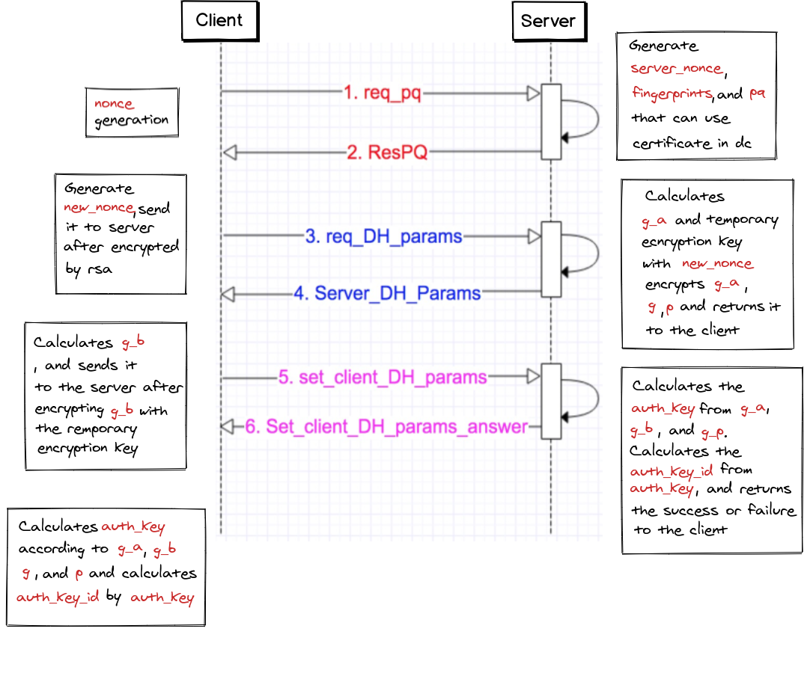

# Creating an Authorization Key
> [Creating an Authorization Key](https://core.telegram.org/mtproto/auth_key)
>
> 
> When creating the auth_key, the interactive messages between the client and server are also described in TL language and binary serialization. It should be noted that large numbers (such as a, p, ga, gb, etc.) are transmitted in big-endian format. . Hash functions (such as SHA1) also use big-endian strings (20 bytes) to return values. Small numbers (int, long, int128, int256) are usually in little-endian format; with one exception, if they are part of SHA1, the bytes are not rearranged, for example, if long x is the low of SHA1 For a 64-bit value, take the last 8 bytes of the 20-byte string SHA1 (s) and interpret it directly as a 64-bit integer. For example, to calculate the certificate fingerprint:
> 
> ```cpp
> uint64_t computeFingerprint (const char * key_data, int key_data_len) {
> // ......
> // Omit the process of packing the n and e of the certificate into obuf
>   uint8_t sha1_digest [20];
>   SHA1 (obuf.data (), obuf.size (), sha1_digest);
>
>   // the last 8 bytes of uint64_t value is fingerprint
>   return * (uint64_t *) (sha1_digest + 12);
>}
> ```

Before sending an unencrypted message(in which case an authorization key needs to be generated), the client must perform(p, q) authorization as follows:

- According to the description of the mtproto protocol, messages are classified as encrypted or unencrypted. They are distinguished by whether the value of the `auth_key_id` field in the message header is 0. If `auth_key_id` is 0, it is unencrypted. Unencrypted messages are just a few messages of the handshake phase (create `auth_key`) described in this document, but unlike encrypted messages, messages in the handshake phase (create `auth_key`) are strictly ordered (can also be understood as Stateful), that is, the first message must be sent before the server returns, and then the second message can be sent.
- So during the handshake phase, here is a rule:
    - If it is an unencrypted message, the first message received by the server must be the (p, q) authorization message `req_pq`.

## Simple creation of auth_key flowchart


## Prepare for DH exchange
- Client sends `req_pq`

	```req_pq # 60469778 nonce: int128 = ResPQ ```

	- A nonce random number is generated by the client to identify the client in the communication. The server will transparently return the nonce value.
	- This step is a clear text exchange.

- Server ResPQ

	```resPQ # 05162463 nonce: int128 server_nonce: int128 pq: string server_public_key_fingerprints: Vector long = ResPQ```

	- nonce is the value sent to the server in the client request message
	- server_nonce is a random number generated by the server
	- The string pq is a number encoded in binary big-endian format. This number is the product of two different odd prime numbers. Generally, pq is less than or equal to 2 ^ 63-1.
	- `server_public_key_fingerprints` is a list of RSA public key fingerprints
		- fingerprint calculation rules:
		
			```cpp 
			// rsa_public_key n: string e: string = RSAPublicKey
			// Where n and е are large numbers serialized into binary data in big-endian format, and SHA1 is calculated.
			uint64_t computeFingerprint (const RSAPublicKey * key) {
				std :: vector <unsigned char> obuf;
				WriteString (key-> n.c_str (), key-> n.length (), obuf);
				WriteString (key-> e.c_str (), key-> e.length (), obuf);
			
				// The calculation method is: the last 8 bytes of SHA1 (server_public_key)
				uint8_t sha1_digest [20];
				SHA1 (obuf.data (), obuf.size (), sha1_digest);
			
			 	// The uint64 value of the last 8 bytes is fingerprint
				return * (uint64_t *) (sha1_digest + 12);
			}
			```
			
		- Some RSA public keys are pre-buried when the client is packaged. The client selects the pre-buried public key through the received `server_public_key_fingerprints` for subsequent processes.
		
	- All subsequent messages contain a plaintext pair (`nonce, server_nonce`) and an encrypted part that identifies the" temporary session "
		- One run of the key generation protocol described on this page uses the same (`nonce, server_nonce`) pair.
			- A run refers to the creation of `auth_key` from the beginning to the end of` auth_key` creation. It can be understood that once the creation is started, it either succeeds or fails, and if it fails, it needs to be re-initiated.
			- Therefore, intruders cannot create parallel sessions with the same parameters, and cannot reuse part of the server or client encrypted messages in such parallel sessions for their own purposes, because each time a session is created, the server will choose a different `server_nonce `Used for any new "temporary session".

	- This step is also a clear text exchange.

- The client decomposes `pq` into prime factors such that p < q.

## Submit p and q to server authentication
- Client sends `req_DH_params`

	`req_DH_params # d712e4be nonce: int128 server_nonce: int128 p: string q: string public_key_fingerprint: long encrypted_data: string = Server_DH_Params`

	- `nonce`: the `req_pq` step has been generated
	- `server_nonce`: Available from `ResPQ`
	- `p, q`: Decompose `pq` into prime factors
	- `public_key_fingerprint`: `ResPQ` and client-side embedded public key query are available
	- Here, `encrypted_data` is obtained as follows:
		- First generate a data in the following format:
	
			```
            p_q_inner_data # 83c95aec pq: string p: string q: string nonce: int128 server_nonce: int128 new_nonce: int256 = P_Q_inner_data
			// or
			p_q_inner_data_temp # 3c6a84d4 pq: string p: string q: string nonce: int128 server_nonce: int128 new_nonce: int256 expires_in: int = P_Q_inner_data;
            ```

		    - `new_nonce`: another (good) random number generated by the client; after this request, both the client and the server know it;

		- Calculate `data_with_hash` so that the length is equal to 255 bytes;
	
			```
			data_with_hash: = SHA1 (data) + data + (any random byte is padded to 255 bytes)
			```
	
		- Generate encrypted_data: Use RSA to encrypt data_with_hash, and the result is stored as a 256-byte number.
		
			```
			encrypted_data: = RSA (data_with_hash, server_public_key)
			```
			
		- The intruder may intercept the query and replace it with his own query, but the intruder cannot get `new_nonce`, and he has to regenerate this field (because the intruder cannot decrypt the encrypted data sent by the client). But all subsequent messages are encrypted with `new_nonce` or contain` new_nonce_hash`, so they will not be processed by the client (intruders cannot make it appear as if they were generated by the server because they do not contain `new_nonce`). Therefore, this interception will only cause the intruder to complete the authorized key generation protocol instead of the client and create a new key (not related to the client);
		- Another form of internal data (`p_q_inner_data_temp`) is used to create a temporary key, which is only stored in the server RAM and discarded after a maximum of expires_in seconds. The server can discard the temporary key at any time. In all other respects, the temporary key generation protocol is the same. After creating the temporary key, the client typically binds it to its principal authorization key via the auth.bindTempAuthKey method and uses it for all client-server communication until it expires; then a new temporary key is generated . This method enables perfect forward privacy (PFS) in client-server communication.

- The server responds in one of two ways:

	```
	server_DH_params_fail # 79cb045d nonce: int128 server_nonce: int128 new_nonce_hash: int128 = Server_DH_Params;
	server_DH_params_ok # d0e8075c nonce: int128 server_nonce: int128 encrypted_answer: string = Server_DH_Params;
	```

	Get encrypted_answer as follows:
	
	- `new_nonce_hash`: = lower 128 bits of` SHA1 (new_nonce) `;
	- `server_DH_inner_data`
		```
		server_DH_inner_data # b5890dba nonce: int128 server_nonce: int128 g: int dh_prime: string g_a: string server_time: int = Server_DH_inner_data;
		```

	- `answer_with_hash: = SHA1 (answer) + answer + (0-15 random bytes)`; make the length divisible by 16;

	- `tmp_aes_key: = SHA1 (new_nonce + server_nonce) + substr (SHA1 (server_nonce + new_nonce), 0, 12)`;
	- `tmp_aes_iv: = substr (SHA1 (server_nonce + new_nonce), 12,8) + SHA1 (new_nonce + new_nonce) + substr (new_nonce, 0,4)`;
	- `encrypted_answer: = AES256_ige_encrypt (answer_with_hash, tmp_aes_key, tmp_aes_iv)`; 

		Here, `tmp_aes_key` is a 256-bit key, and` tmp_aes_iv` is a 256-bit initialization vector(IV). As with all other instances using AES encryption, encrypted data is padded with random bytes before encryption to a length that is divisible by 16.
		
	After this step, `new_nonce` is still only visible to the client and server. The client can be sure that it is a legitimate server, and the response is generated specifically in response to the client's query `req_DH_params`, because the response data is encrypted using new_nonce.

	The client checks if p = dh_prime is a safe 2048-bit prime number (meaning p and (p-1) / 2 are both prime numbers, and  (2 ^ 2047 < p < 2 ^ 2048), and g generates (p-1) The cyclic subgroup of / 2, i.e the quadratic remainder mod p. Because g is always equal to 2, 3, 4, 5, 6, or 7, this is easily done with the law of quadratic reciprocity, resulting in a simple condition on p mod 4g
	
	- For g = 2, p mod 8 = 7; 
	- For g = 3, p mod 3 = 2; 
	- g = 4 without additional conditions; 
	- p mod 5 = 1 or 4 for g = 5; 
	- For g = 6, p mod 24 = 19 or 23; 
	- For g = 7, p mod 7 = 3, 5 or 6.
	
	After the client checks `g` and `p`, the results can be cached so that no lengthy calculations are repeated in the future.

	If the verification takes too long (for older mobile devices), you may initially run only 15 Miller-Rabin iterations to verify the initiality of p and (p-1) / 2, with a probability of error not exceeding one in one billion , Do more iterations later in the background.

	Another optimization is to embed some small tables with some known "good" pairs (g, p) in the client application code (or just the known safe prime p, because the condition on g is easy to execute (Verified during the process), during code generation, to avoid such verification at runtime. The server rarely changes these values, so it is often necessary to put the current value of the server's dh_prime into such a table. For example, the current value of `dh_prime` is equal to (in big-endian byte order):

	```
		C7 1C AE B9 C6 B1 C9 04 8E 6C 52 2F 70 F1 3F 73 98 0D 40 23 8E
		3E 21 C1 49 34 D0 37 56 3D 93 0F 48 19 8A 0A A7 C1 40 58 22 94
		93 D2 25 30 F4 DB FA 33 6F 6E 0A C9 25 13 95 43 AE D4 4C CE 7C 
		37 20 FD 51 F6 94 58 70 5A C6 8C D4 FE 6B 6B 13 AB DC 97 46 51 
		29 69 32 84 54 F1 8F AF 8C 59 5F 64 24 77 FE 96 BB 2A 94 1D 5B 
		CD 1D 4A C8 CC 49 88 07 08 FA 9B 37 8E 3C 4F 3A 90 60 BE E6 7C 
		F9 A4 A4 A6 95 81 10 51 90 7E 16 27 53 B5 6B 0F 6B 41 0D BA 74 
		D8 A8 4B 2A 14 B3 14 4E 0E F1 28 47 54 FD 17 ED 95 0D 59 65 B4 
		B9 DD 46 58 2D B1 17 8D 16 9C 6B C4 65 B0 D6 FF 9C A3 92 8F EF 
		5B 9A E4 E4 18 FC 15 E8 3E BE A0 F8 7F A9 FF 5E ED 70 05 0D ED 
		28 49 F4 7B F9 59 D9 56 85 0C E9 29 85 1F 0D 81 15 F6 35 B1 05 
		EE 2E 4E 15 D0 4B 24 54 BF 6F 4F AD F0 34 B1 04 03 11 9C D8 E3 
		B9 2F CC 5B
	```

- The client generates a 2048-bit random number b and sends it to the server

	`set_client_DH_params # f5045f1f nonce: int128 server_nonce: int128 encrypted_data: string = Set_client_DH_params_answer;`

	- Here, `encrypted_data` is obtained like this:
	
		`g_b: = pow (g, b) mod dh_prime`;

	- Data:
		`client_DH_inner_data # 6643b654 nonce: int128 server_nonce: int128 retry_id: long g_b: string = Client_DH_Inner_Data`
  	
	- `data_with_hash`: = SHA1 (data) + data + (0-15 random bytes)`; make the length divisible by 16;

	- `encrypted_data: = AES256_ige_encrypt (data_with_hash, tmp_aes_key, tmp_aes_iv)`;
	
	- The `retry_id` field is equal to zero on the first attempt; otherwise, it is equal to` auth_key_aux_hash` when the previous attempt failed (see item 9).

- After that, `auth_key` is equal to` g ^ (ab) mod dh_prime`; the server calculates the result from `(g_b) ^ a mod dh_prime`, and the client calculates the result from` (g_a) ^ b mod dh_prime`.

- Calculate the 64 low-order bits of `auth_key_hash: = SHA` (` auth_key`). The server checks if another key with the same `auth_key_hash` already exists, and responds in one of the following ways.

## DH key exchange completed
- The server responds in one of three ways:

	```
	dh_gen_ok # 3bcbf734 nonce: int128 server_nonce: int128 new_nonce_hash1: int128 = Set_client_DH_params_answer;
	dh_gen_retry # 46dc1fb9 nonce: int128 server_nonce: int128 new_nonce_hash2: int128 = Set_client_DH_params_answer;
	dh_gen_fail # a69dae02 nonce: int128 server_nonce: int128 new_nonce_hash3: int128 = Set_client_DH_params_answer;
	```

	- `new_nonce_hash1`,` new_nonce_hash2` and `new_nonce_hash3` are obtained as the 128 low-order bits of SHA1 of the byte string derived from the` new_nonce` string, by adding a single byte with a value of 1, 2 or 3, and then Have another 8 bytes of `auth_key_aux_hash`. Different values ​​are required to prevent intruders from changing the server response `dh_gen_ok` to` dh_gen_retry`.
    `auth_key_aux_hash` is the 64 higher bits of` SHA1 (auth_key) `. It should not be confused with `auth_key_hash`.

		- In another case, the client regenerates a b.
	
		- In the first case, the client and server have negotiated `auth_key`, then they have forgotten all other temporary data, and the client uses `auth_key` to create another encrypted session. Meanwhile, `server_salt` is initially set to `substr (new_nonce, 0, 8) XOR substr (server_nonce, 0, 8) `. If necessary, the client stores the difference between the server_time received in 5) and its local time to correct the client time and use it to generate the `msg_id` of subsequent messages to the server.

	- Important: In addition to the conditions of the Diffie-Hellman primes `dh_prime` and the g generator, both parties must check whether g,` g_a` and `g_b` are greater than 1 and less than` dh_prime-1`. We recommend checking if `g_a` and` g_b` are between `2 ^ {2048-64}` and `dh_prime-2 ^ {2048-64}`.

	- Error handling (missed queries and responses)
		- If the client does not receive a response to the server query within a certain time interval, it can resend the query. If the server has already sent a response to this query (*exactly the same request, not just similar: all parameters must have the same value during repeated requests), but the server will only resend the same if it does not reach the client the response to. The server remembers a response of up to 10 minutes after receiving the query in 1). If the server has forgotten the response or the necessary temporary data, the client will have to start from scratch.

		- The server can assume that if the client has sent the next query using data from the previous server's response to a particular client, it is known that the response has been received by the client and may be forgotten by the server.

## Example usage
> An example of the complete query list required to generate an authorization key is shown on a separate page.
